# Exploring the Membrane Test with a Voltage-Clamped Neuron Model

**By modeling a voltage-clamp amplifier, patch pipette, and cell membrane as a circuit** using free circuit simulation software, I was able to create a virtual patch-clamp electrophysiology workstation and challenge model neurons with advanced voltage-clamp protocols. By modeling neurons with known properties and simulating experimental membrane test protocols, I can write membrane test analysis software and confirm its accuracy by comparing my calculated membrane measurements to the values in the original model. A strong advantage of this method (compared to using physical model cells) is that I can easily change values of any individual component to assess how it affects the accuracy of my analytical methods.

<div class="text-center">

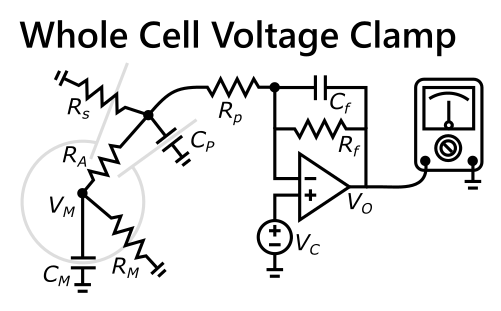

</div>

**Instead of modeling a neuron, I modeled the whole patch-clamp system:** the amplifier (with feedback and output filtering), pipette (with an imperfect seal, series resistance, and capacitance), and cell (with membrane resistance, capacitance, and a resting potential). After experimenting with this model for a while I realized that advanced topics (like pipette capacitance compensation, series resistance compensation, and amplifier feedback resistance) become much easier to understand when they are represented as components in a circuit with values that can be adjusted to see how the voltage-clamp trace is affected. Many components of the full model can be eliminated to generate ideal traces, and all models, diagrams, and code shown here can be downloaded from my [membrane test repository](https://github.com/swharden/memtest) on GitHub.

## Circuit Components

### Cell

* **`Vm` (Membrane Potential):** Voltage difference across the neuron's membrane. _Neurons typically maintain a membrane potential near -70 mV. In our model we can simulate this by connecting `Rm` to a -70 mV voltage source instead of grounding it as shown in the diagram above._

* **`Rm` (Membrane Resistance):** The resistance across the cell membrane. _Resistance is inversely correlated with membrane conductivity (influenced primarily by the number of open channels in the membrane). Membrane resistance is sometimes termed "input resistance" because in combination with cell capacitance it determines the time constant of the voltage response to input currents._

* **`Cm` (Membrane Capacitance):** The capacitance of a neuron describes how much charge is required to change its voltage. _Larger cells with more membrane surface area have greater capacitance and require more charge (current times time) to swing their voltage._

* **`Tau` (Membrane Time Constant, τ<sub>cell</sub>):** The membrane time constant describes how fast the cell changes voltage in response to currents across its membrane. This is distinctly different than the voltage clamp time constant which describes how fast the cell changes voltage in response to currents delivered through the patch pipette (dependent on Ra, not Rm). _This metric is best thought of with respect to synaptic currents (not currents delivered through the patch pipette). This is a true biological property of the cell, as it exists even when a pipette is not present to measure it. Membrane time constant is membrane capacitance times membrane resistance. If two cells have the same resistance, the larger one (with greater capacitance) will have a slower membrane time constant._

### Pipette

* **`Ra` (Access Resistance):** The resistance caused by the small open tip of the patch pipette. _If a pipette tip gets clogged this resistance will increase, leading to a failed experiment. Access resistance is the primary contributor to series resistance, but a lesser contributor to input resistance._

* **`Rp` (Pipette Resistance):** Resistance between the amplifier and the tip of the pipette. _Resistance of the solution inside the electrode forms a large component of this resistance, but it is such a low resistance is can often be ignored. Its most important consideration is how it combines with Cp to form a low-pass filter inside the pipette (partially overcome by series resistance compensation) to disproportionately degrade fast voltage-clamp transitions._

* **`Rs` (Seal Resistance):** The resistance formed by the seal between the cell surface and the glass pipette. _Ideal experiments will have high seal resistances in the GΩ range._

* **`Rseries` (Series Resistance):** Sum of all non-biological resistances. Access resistance is the largest contributor to series resistance, but pipette resistance and reference electrode resistance also influences it. _Series resistance is bad for two reasons: it acts as a low-pass filter inside the pipette (reducing magnitude of small transients), and it also acts as a voltage divider in series with membrane resistance (resulting in steady-state voltage error). How impactful each of these are to your experiment is easy to calculate or simulate, and a good experiment will have a membrane / series resistance ratio greater than 10._

* **`TauClamp` (Voltage Clamp Time Constant, τ<sub>clamp</sub>):** The voltage clamp time constant describes how fast the cell changes voltage in response to currents delivered through the patch pipette. _This metric is largely determined by access resistance, and it is typically much smaller than the membrane time constant. It describes the relationship between Ra and Cm, and it does not involve Rm. I consider this measurement purely artificial (not biological) because when a pipette is not in a cell this time constant does not exist._

### Amplifier

* **`Vc` (Command Voltage):** This is the voltage the experimenter tries to move the cell toward. _This isn't always exactly what the cell gets though. First, `Cp` and `Rp` form a small low-pass filter delaying measurement of `Vm`. Similarly, `Ra` and `Cm` form a low-pass filter that delays the clamp system from being able to rapidly swing the voltage of the cell. Finally, `Ra` and `Rm` combine to form a voltage divider, leading the amplifier to believe the cell's voltage is slightly closer to `Vc` than it actually is. Many of these issues can be reduced by capacitance compensation and series resistance compensation._

* **`Vo` (Amplifier Output Voltage):** This voltage exiting the amplifier. It is proportional to the current entering the pipette (passing through Rf according to Ohm's law). _Divide this value by `Rf` to determine the current emitted from the amplifier._

* **`Rf` (Feedback Resistance):** Negative feedback for the amplifier. _The greater the resistance the smaller the noise but the smaller the range of the output. Large resistances >1GΩ are used for single channel recordings and lower resistances <1GΩ are used for whole-cell experiments._

* **`Cf` (Feedback Capacitance):** This capacitor forms an RC low-pass filter with `Rf` to prevent ringing or oscillation. _This is tangentially related to capacitance compensation which uses variable capacitance to a computer-controlled voltage to reduce the effects of `Cp`. The main point of this capacitor here is to stabilize our simulation when `Cp` is added._

* **`Io` (Clamp Current):** Current entering the pipette. _This isn't measured directly, but instead calculated from the amplifier's output voltage (measured by an analog-to-digital converter) and calculated as `Vo/Rf` according to Ohm's law._

## Modeling a Patch-Clamp Experiment in LTSpice

**[LTSpice](https://en.wikipedia.org/wiki/LTspice) is a free analog circuit simulator by Analog Devices.** I enjoy using this program, but only because I'm used to it. For anyone trying to use it for the first time, I'm sorry. Watch a YouTube tutorial to learn how to get up and running with it. [Models used in this project are on GitHub](https://github.com/swharden/memtest) if you wish to simulate them yourself.

<div class="text-center img-border">

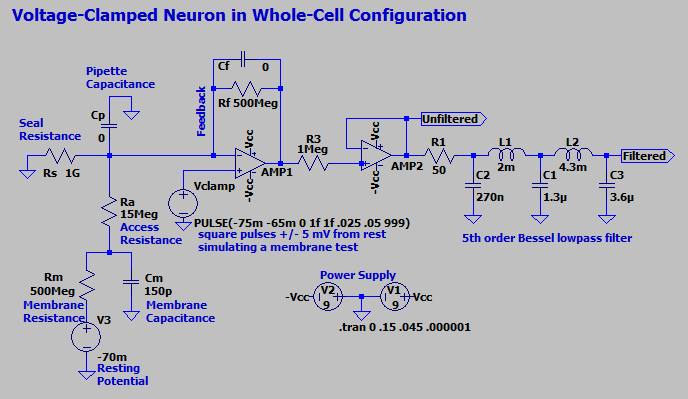

</div>

**This circuit simulates a voltage clamp membrane test** (square pulses, ±5mV, 50% duty, 20 Hz) delivered through a patch pipette (with no pipette capacitance), a 1GΩ seal, 15 MΩ access resistance, in whole-cell configuration with a neuron resting at -70 mV with 500 MΩ membrane resistance and 150 pF capacitance. The Bessel filter is hooked-up through a unity gain op-amp so it can be optionally probed without affecting the primary amplifier. It's configured to serve as a low-pass filter with a cut-off frequency of 2 kHz.

## Simulating a Membrane Test

**The simulated membrane test shows a typical voltage-clamp trace (green)** which is interesting to compare to the command voltage (red) and the actual voltage inside the cell (blue). Note that although the hardware low-pass filter is connected, the green trace is the current passing through the feedback resistor (Rf). A benefit of this simulation is that we can probe anywhere, and being able to see how the cell's actual voltage differs from the target voltage is enlightening.

<div class="text-center img-border">

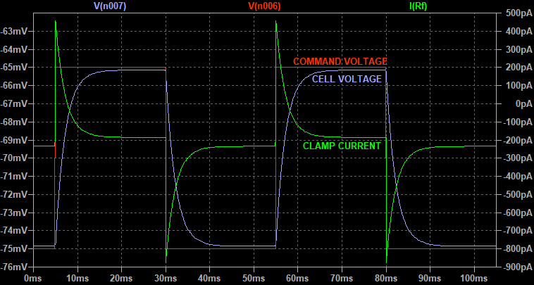

</div>

**If your clamp voltage does not have sharp transitions**, manually define rise and fall times as non-zero values in the voltage pulse configuration options. Not doing this was a huge trap I fell into. If the rise time and fall time is left at `0`, LTSpice will invent a time for you which defaults to 10%! This slow rise and fall of the clamp voltage pulses was greatly distorting the peaks of my membrane test, impairing calculation of I0, and throwing off my results. When using the PULSE voltage source set the rise and fall times to `1p` (1 picosecond) for ideally sharp edges.

**If saving simulation data consider defining the maximum time step.** Leaving this blank is typically fine for inspecting the circuit within LTSpice, but if you intend to save .raw simulation files and analyze them later with Python (especially when using interpolation to simulate a regular sample rate) define the time step to be a very small number before running the simulation.

## Low-Pass Filtering

**Let's compare the output of the amplifier before and after low-pass filtering.** You can see that the Bessel filter takes the edge off the sharp transient and changes the shape of the curve for several milliseconds. This is an important consideration for analytical procedures which seek to measure the time constant of the decay slope, but I'll leave that discussion for another article.

<div class="text-center img-border">

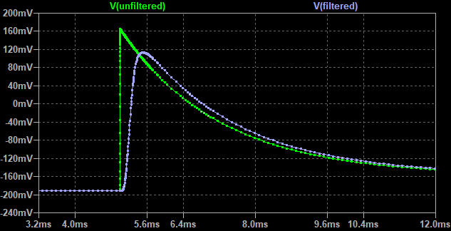

</div>

## Calculate Clamp Current from Amplifier Output Voltage

**Patch-clamp systems use a digital-to-analog converter which measures voltage coming out of the amplifier to infer the current being delivered into the pipette.** In other words, the magic ability LTSpice gives us to probe current passing through any resistor in the circuit isn't a thing in real life. Instead, we have to use Ohm's law to calculate it as the ratio of voltage and feedback resistance. 

**Let's calculate the current** flowing into the pipette at the start of this trace when the amplifier's output voltage is -192 mV and our command potential is -75 mV:

```
V = I * R
I = V / R
I = (Vout - Vcmd) / Rf
I = ((-192e-3 V) - (-75e-3 V)) / 500e6 Ω
I = -234 pA
```

Notice I use math to get the difference of `Vout` and `Vcmd`, but in practice this is done at the circuit level using a differential amplifier instead of a unity gain op-amp like I modeled here for simplicity.


## Amplifier Feedback Capacitance

**Let's further explore this circuit by adding pipette capacitance.** I set `Cp` to 100 pF (I know this is a large value) and observed strong oscillation at clamp voltage transitions. This trace shows voltage probed at the output of the Bessel filter.

<div class="text-center img-border">

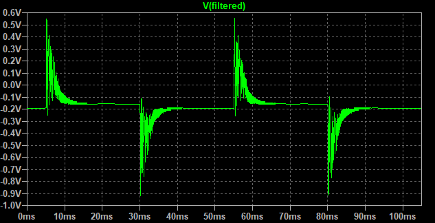

</div>

**A small amount of feedback capacitance reduced this oscillation**. The capacitor `Cf` placed across `Rf` serves as an RC low-pass filter to tame the amplifier's feedback. Applying too much capacitance slows the amplifier's response unacceptably. It was impressive to see how little feedback capacitance was required to change the shape of the curve. In practice parasitic capacitance likely makes design of patch-clamp amplifier headstages very challenging. Experimenting with different values of `Cp` and `Cf` is an interesting experience. Here setting `Cp` to 1 pF largely solves the oscillation issue, but its low-pass property reduces the peaks of the capacitive transients.

<div class="text-center img-border">

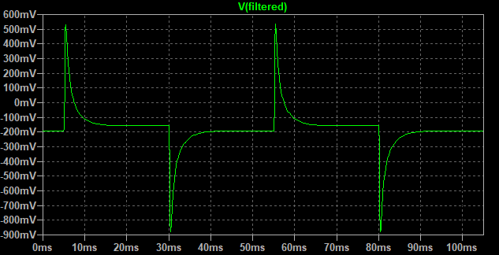

</div>

## Two-Electrode Giant Squid Axon Model

**I created another model to simulate a giant squid axon studied with a two-electrode system.** It's not particularly useful other than as a thought exercise. By clamping between two different voltages you can measure the difference in current passing through the stimulation resistor to estimate the neuron's membrane resistance. [This model is on GitHub](https://github.com/swharden/memtest) too if you want to change some of the parameters and see how it affects the trace.

<div class="text-center img-border">

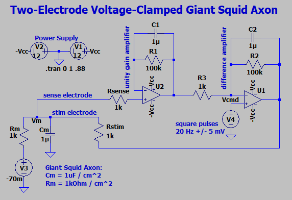
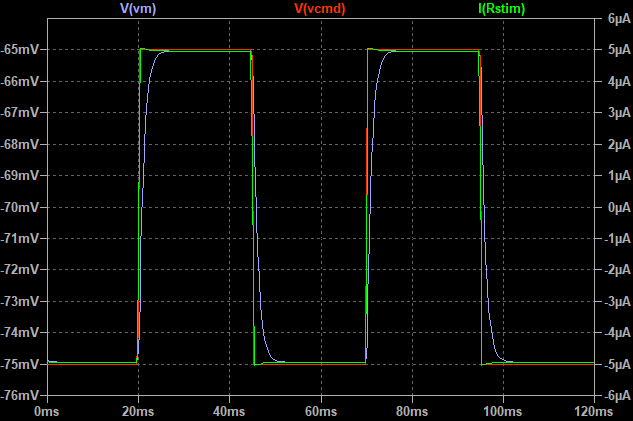

</div>

**Let's calculate the squid axon's membrane resistance** from the simulation data just by eyeballing the trace.

```
ΔV = (-65 mV) - (-75 mV) = 10 mV <-- Δ command voltage
ΔI = (5 µA) - (-5 µA) = 10 µA <-- Δ amplifier current
```

```
V = I * R
ΔV = ΔI * Rm
Rm = ΔV / ΔI
Rm = 10e-3 V / 10e-6 A
Rm = 1kΩ <-- calculated membrane resistance
```

## Load LTSpice Simulation Data with Python

**LTSpice simulation data is saved in .raw files can be read analyzed with Python** allowing you to leverage modern tools like numpy, scipy, and matplotlib to further explore the ins and outs of your circuit. I'll discuss membrane test calculations in a future post. Today let's focus on simply getting these data from LTSpice into Python. [Simulation data and full Python code is on GitHub](https://github.com/swharden/memtest). Here we'll analyze the .raw file generated by the whole-cell circuit model above.

```python
# read data from the LTSpice .raw file
import ltspice
l = ltspice.Ltspice("voltage-clamp-simple.raw")
l.parse()

# obtain data by its identifier and scale it as desired
times = l.getTime() * 1e3 # ms
Vcell = l.getData('V(n003)') * 1e3  # mV
Vcommand = l.getData('V(vcmd)') * 1e3  # mV
Iclamp = l.getData('I(Rf)') * 1e12  # pA
```

<div class="text-center">

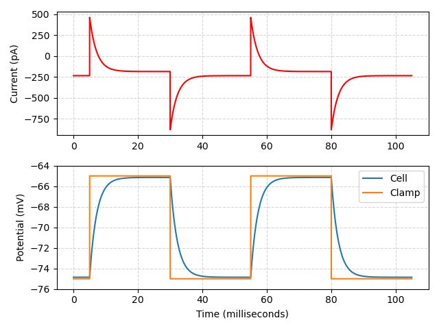

</div>

```python
# plot scaled simulation data
import matplotlib.pyplot as plt

ax1 = plt.subplot(211)
plt.grid(ls='--', alpha=.5)
plt.plot(times, Iclamp, 'r-')
plt.ylabel("Current (pA)")

plt.subplot(212, sharex=ax1)
plt.grid(ls='--', alpha=.5)
plt.plot(times, Vcell, label="Cell")
plt.plot(times, Vcommand, label="Clamp")
plt.ylabel("Potential (mV)")
plt.xlabel("Time (milliseconds)")
plt.legend()

plt.margins(0, .1)
plt.tight_layout()
plt.show()
```

**LTSpice simulation data points are not evenly spaced** in time and may require interpolation to produce data similar to an actual recording which samples data at a regular rate. This topic will be covered in more detail in a later post.

## Membrane Test Analysis

**Let's create an ideal circuit, simulate a membrane test, then analyze the data to see if we can derive original values for access resistance (Ra), cell capacitance (Cm), and membrane resistance (Rm).** I'll eliminate little tweaks like seal resistance, pipette capacitance, and hardware filtering, and proceed with a simple case voltage clamp mode.

<div class="text-center">

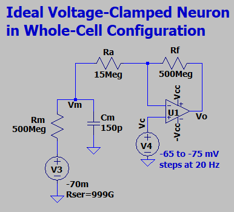

</div>

> **⚠️ WARNING:** LTSpice voltage sources have a non-negligible conductance by default, so if you use a voltage source at the base of Rm without a defined resistance you'll have erroneous steady state current readings. Prevent this by defining series resistance to a near infinite value instead of leaving it blank.

Now let's run the simulation and save the output...

<div class="text-center">

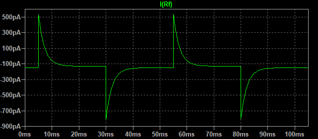

</div>

I created a diagram to make it easier to refer to components of the membrane test:

<div class="text-center">

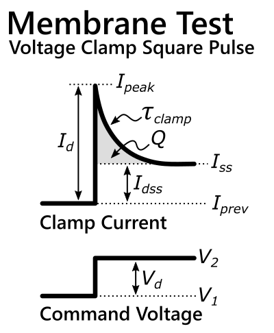

</div>

**Think conceptually about what's happening here:** When the command voltage abruptly changes, `Vcell` and `Vcommand` are very different, so the voltage-clamp amplifier delivers a large amount of current right after this transition. The peak current (`Ipeak`) occurs at time zero relative to the transition. The current change between the previous steady-state current (`Iprev`) and the peak current (`Ipeak`) is only limited by `Ra` (since `Cm` only comes in to play after time passes). Let's call this maximum current change `Id`. With more time the current charges `Cm`, raising the `Vcell` toward (`Vcommand`) at a rate described by `TauClamp`. As `Vcell` approaches `Vcommand` the amplifier delivers less current. Altogether, amplifier current can be approximated by an exponential decay function:

<div class="text-center">

I<sub>t</sub> = I<sub>d</sub> * exp(-t / τ<sub>clamp</sub>) + I<sub>ss</sub>

</div>

### Analyze the Capacitive Transient

**The speed at which `Vcell` changes in response to current delivered through the pipette** is a property of resistance (`Ra`) and capacitance (`Cm`). By studying this curve, we can calculate both. Let's start by isolating one curve. We start by isolating individual capacitive transients:

<div class="text-center">

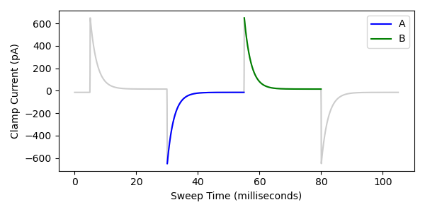

</div>

**Fit each curve to a single exponential function.** I'll gloss over how to do this because it is different for every programming language and analysis software. See my [Exponential Fit with Python](https://swharden.com/blog/2020-09-24-python-exponential-fit/) for details. Basically you'll fit a curve which has 3 parameters: `m`, `tau`, and `b`. You may wish to change the sign of tau depending on the orientation of the curve you are fitting. If your signal is low-pass filtered you may want to fit a portion of the curve avoiding the fastest (most distorted) portion near the peak. If you want to follow along, [code for this project is on GitHub](https://github.com/swharden/memtest).

<div class="text-center">

I<sub>t</sub> = m \* exp(-t / tau) + b


</div>

These are the values I obtained by fitting the curve above:

```
m = 667.070
tau = 2.250
b = -129.996
```

Meaning the curve could be modeled by the equation:
```
I = 667.070 * exp(-t / 2.250) -129.996
```

From these values we can calculate the rest:

* `tau` is one of the fitted parameters and has the same time units as the input data. Don't confuse this value with the cell's time constant (which describes how current across `Rm` changes `Vm`), but instead this value is the time constant of the voltage clamp system (where current across `Ra` changes `Vm`). Because `Ra` is much smaller than `Rm`, this will be a much faster time constant.

* State current (`Iss`) is `b` from the curve fit

* The state current before the step will be called `Iprev`

* Change in old vs. new steady state current will be `Idss`

* Peak current (`Ipeak`) occurs at time zero (when the exponential term is 1) so this is simply `m + b`

* `Id` is peak transient current (difference between `Ipeak` and `Iprev`). Some papers call this `I0`, but other papers use that abbreviation to refer to `Ipeak`, so I'll avoid using that term entirely.

We now have:

```
Iss: -129.996 pA
Iprev: -150.015 pA
Idss: 20.019 pA
Ipeak: 537.074 pA
Id: 687.089 pA
dV: 10 mV
TauClamp: 2.250 ms
```

### Calculate Ra

At time zero, access resistance is the thing limiting our ability to deliver current (`Id`) to a known `ΔV` (10 mV). Therefore we can calculate `Ra` using Ohm's law:

```
V = I * R
ΔV = ΔI * R
R = ΔV / ΔI
Ra = dV / Id
Ra = 10e-3 V / 687.089e-12 A
Ra = 14.554 MΩ <-- pretty close to our model 15 MΩ
```

For now let's call this `Ra`, but note that this is technically `Ra` mixed with a small leakage conductance due to `Rm`. Since `Ra` is so much smaller than `Rm` this small conductance doesn't affect our measurement much. Accuracy of this value will be improved when we apply leak current correction described later on this page.

### Calculate Rm

Now that we know `Ra`, we can revisit the idea that the difference between this steady state current (`Iss`) and the last one (`Iprev`) is limited by the sum of `Rm` and `Ra`. let's use this to calculate `Rm` using Ohm's law:

```
V = I * R
I = V / R
ΔI = ΔV / R
R * ΔI = ΔV
(Ra + Rm) * ΔI = ΔV
Ra * ΔI + Rm * ΔI = ΔV
Rm * ΔI = ΔV - Ra * ΔI
Rm = (ΔV - Ra * ΔI) / ΔI
Rm = (dV - Ra * Idss) / Idss
Rm = (10e-3 V - (14.554e6 Ω * 20.019e-12 A)) / 20.019e-12 A
Rm = 485 MΩ <-- pretty close to our model 500 MΩ
```

Accuracy of this value will be improved when we apply leak current correction described later on this page.

### Calculate Cm from Ra, Rm, and Tau

When we raise the cell's voltage (`Vm`) by delivering current through the pipette (`Ra`), some current escapes through `Rm`. From the cell's perspective when we charge it though, `Ra` and `Rm` are in parallel.

```
tau = R * C
C = tau / R
Cm = tau / (1/(1/Ra + 1/Rm))
Cm = 2.250e-3 sec / (1/(1/14.554e6 Ω + 1/485e6 Ω))
Cm = 159 pF <-- pretty close to our model 150 pF
```

Accuracy of this value will be improved when we apply leak current correction described later on this page.

### Calculate Cm from the Area Under the Curve

**Cell capacitance can alternatively be estimated by measuring the area under the capacitive transient.** This method is frequently used historically, and it is simpler and faster than the method described above because it does not require curve fitting. Each method has its pros and cons (e.g., sensitivity to access resistance, hardware filtering, or resilience in the presence of noise or spontaneous synaptic currents). Rather than compare and contrast the two methods, I'll simply describe the theory underlying how to perform this measurement.

<div class="text-center">

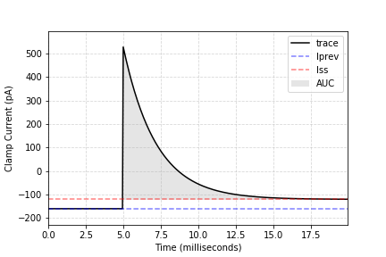

</div>

**After an abrupt voltage transition, all current delivered above the steady state current level goes toward charging the cell,** so by integrating this current over time we can calculate how much charge (`Q`) was delivered. I'll describe this measurement as area under the curve (AUC). When summing these data points yourself be sure to remember to subtract steady state current and divide by the sample rate. [Code for this example is on GitHub](https://github.com/swharden/memtest).

**Charge is measured in Coulombs.** Area under the curve is `1515.412 pA*ms`, but recall that a _femtocoulomb_ is 1pA times 1ms, so it's more reasonable to describe the AUC as `1515.412 fC`. This is the charge required to raise cell's capacitance (`Cm`) by `dV`. The relationship is described by:

```
Q = C * ΔV
C = Q / ΔV
Cm = AUC / ΔV
Cm = 1515.412e-15 C / 10e-3 V
Cm = 1515.412e-15 C / 10e-3 V
Cm = 151.541 pF <-- pretty close to our model 150 pF
```

**This value is pretty close to what we expect**, and I think its accuracy in this case is largely due to the fact that we simulated an ideal unfiltered voltage clamp trace with no noise. Its under-estimation is probably due to the fact that a longer period wasn't used for the integration (which may have been useful for this noise-free simulation, but would not be useful in real-world data). Additional simulation experiments with different combinations of noise and hardware filtering would be an interesting way to determine which methods are most affected by which conditions. Either way, this quick and dirty estimation of whole-cell capacitance did the trick in our model cell.

## Correcting for Leak Current

**Why weren't our measurements exact?** `Rm` leaks a small amount of the `Id` current that passes through `Ra` to charge `Cm`. If you calculate the parallel combined resistance of `Ra` and `Rm` you get `14.56 MΩ` which is pretty much exactly what we measured in our first step and simply called `Ra` at the time. Now that we know the value of both resistances we can calculate a correction factor as the ratio of `Ra` to `Rm` and multiply it by both of our resistances. `Cm` can be corrected by dividing it by the square of this ratio.

```
correction = 1 + Ra / Rm
correction = 1 + 14.554 MΩ / 484.96 MΩ
correction = 1.03

Ra = Ra * correction
Rm = Rm * correction
Cm = Cm / (correction^2)
```

<div class="text-center">

Metric | Model | Measured | Corrected | Error
---|---|---|---|--
Ra|15 MΩ|14.55 MΩ|14.99 MΩ|<1%
Rm|500 MΩ|484.96 MΩ|499.51 MΩ|<1%
Cm (fit)|150 pF|159.20 pF|150.06 pF|<1%

</div>

**This correction is simple** and works well when `Ra/Rm` is small. It's worth noting that an alternative to this correction is to solve for `Ra` and `Rm` simultaneously. The [Membrane Test Algorithms](https://mdc.custhelp.com/app/answers/detail/a_id/17006/~/membrane-test-algorithms) used by pCLAMP calculate `Ra` this way, solving the following equation iteratively using the Newton-Raphson method:

```
Ra^2 - Ra * Rt + Rt * (Tau/Cm) = 0
```

**Overall the values I calculated are within a few percent of expectations,** and I'm satisfied with the calculation strategy summarized here. I am also impressed with what we were able to achieve by modeling a voltage-clamped neuron using a free circuit simulator!

## Use a Voltage-Clamp Ramp to Measure Cm

**It's possible to simulate a voltage-clamp _ramp_ and analyze that trace to accurately measure cell capacitance.** A strong advantage of this method is that it does not depend on `Ra`. Let's start by simulating a 10 mV ramp over 100 ms (50 ms down, 50 ms up). When we simulate this with LTSpice and plot it with Python ([screenshots, data, and code is on GitHub](https://github.com/swharden/memtest)) we find that cell voltage lags slightly behind the clamp voltage.

<div class="text-center">

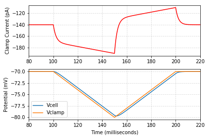

</div>

**During voltage-clamp ramps `Vm` lags behind the command voltage because charging `Cm` is limited by `Ra`.** If we measure the difference in this lag between descending and ascending ramps, we can estimate `Cm` in a way that is insensitive to `Ra`. Stated another way, `Ra` only affects abrupt changes in charging rate. Once the cell is charging at a steady rate, that rate of charge is largely unaffected by `Ra` because the stable charging current is already increased to counteract the previous effect `Ra`. Stated visually, `Ra` only affects the rate of charging at the corners of the V. Therefore, let's proceed ignoring the corners of the V and focus on the middle of each slope where the charging rate is stable (and effect of `Ra` is negligible).

<div class="text-center">

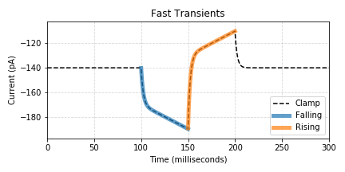

</div>

**Analysis is achieved by comparing the falling current to the rising current.** We start separately isolating the falling and rising traces, then reverse one of them and plot the two on top of each other. The left and right edges of this plot represent edges of ramps where the system is still stabilizing to compensate for `Ra`, so let's ignore that part and focus on the middle where the charging rate is stable. We can measure the current lag as half of the mean difference of the two traces. Together with the rate of charge (the rate of the command voltage change) we have everything we need to calculate `Cm`.

<div class="text-center">

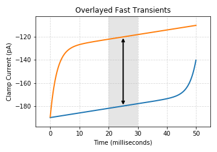

</div>

```
dI = dQ / dt
dI = Cm * dV / dt
Cm = dI / (dV / dT)
Cm = (59.997e-12 A / 2) / (10e-3 V / 50e-3 sec) <-- 10 mV over 50 ms
Cm = 149.993 pF <-- Our model is 150 pF
```

**This is a fantastic result!** The error we do get is probably the result of a single point of interpolation error while converting the unevenly spaced simulation data to an evenly-spaced array simulating a 20 kHz signal. In this ideal simulation this method of calculating `Cm` appears perfect, but in practice it is highly sensitive to sporadic noise that is not normally distributed (like synaptic currents). If used in the real world each ramp should be repeated many times, and only the quietest sweeps (with the lowest variance in the difference between rising and falling currents) should be used for analysis. However, this is not too inconvenient because this protocol is so fast (10 repetitions per second).

## Summary

**This page described how to model voltage-clamp membrane test sweeps and analyze them to calculate Ra, Cm, and Rm.** We validated our calculations were accurate by matching our calculated values to the ones used to define the simulation. We also explored measuring the area under the curve and using voltage-clamp ramps as alternative methods for determining `Cm`. There are a lot of experiments that could be done to characterize the relationship of noise, hardware filtering, and cell properties on the accuracy of these calculations. For now though, I'm satisfied with what we were able to achieve with free circuit simulation software and basic analysis with Python. [Code for this project is on GitHub](https://github.com/swharden/memtest).

<div class="text-center">

Metric | Model | Calculated | Error
---|---|---|---
Ra|15 MΩ|14.99 MΩ|<1%
Rm|500 MΩ|499.51 MΩ|<1%
Cm (fit)|150 pF|150.06 pF|<1%
Cm (auc)|150 pF|151.541 pF|~1%
Cm (ramp)|150 pF|149.993 pF|<.01%

</div>

## Resources

* [LTSpice models, simulations, and Python code on GitHub](https://github.com/swharden/memtest)

* [Download LTspice](https://www.analog.com/en/design-center/design-tools-and-calculators/ltspice-simulator.html) - a high performance SPICE simulation software, schematic capture, and waveform viewer with enhancements and models for easing the simulation of analog circuits.

* The [LC Filter Design Tool](https://rf-tools.com/lc-filter/) makes it easy to design filter circuits using common component values

* [The Patch-clamp Technique Explained And Exercised With The Use Of Simple Electrical Equivalent Circuits](https://mdc.custhelp.com/euf/assets/images/KB864_ModelCells.pdf) by Dirk L Ypey and Louis J. DeFelice
 
* [Series Resistance Compensation](Drexel_Gao_Lab_Series_Resistance_Compensation.pdf) by [Wen-Jun Gao](https://drexel.edu/medicine/about/departments/neurobiology-anatomy/research/gao-lab/)

* [How to correct for series resistance (and whole cell capacitance) in real cells](http://www.billconnelly.net/?p=616) by [Bill Connelly](https://www.utas.edu.au/profiles/staff/health/bill-connelly)

* [Series Resistance. Why it’s bad.](http://www.billconnelly.net/?p=310) by [Bill Connelly](https://www.utas.edu.au/profiles/staff/health/bill-connelly)

* [MultiClamp 700B Theory and Operation](https://mdc.custhelp.com/euf/assets/content/MultiClamp_700B_Manual2.pdf)

* [Introduction to Operational Amplifiers with LTSpice](https://learn.sparkfun.com/tutorials/introduction-to-operational-amplifiers-with-ltspice/all)

* [pyABF](https://swharden.com/pyabf/) - A simple Python interface for ABF files

* [What we talk about when we talk about capacitance measured with the voltage-clamp step method](https://www.ncbi.nlm.nih.gov/pmc/articles/PMC3273682/pdf/10827_2011_Article_346.pdf) by Adam L. Taylor (2012)

* [Membrane Capacitance Measurements Revisited: Dependence of Capacitance Value on Measurement Method in Nonisopotential Neurons](https://journals.physiology.org/doi/pdf/10.1152/jn.00160.2009) (Golowasch et al., 2009) discusses 3 ways to calculate capacitance: a current-clamp step, a voltage-clamp step, and a V-shaped pair or voltage-clamp ramps.

* [Techniques for Membrane Capacitance Measurements](https://link.springer.com/chapter/10.1007/978-1-4419-1229-9_7) (Single-Channel Recording, chapter 7) describes the membrane test using a simplified circuit similar to what is discussed here. This is the closest text to a step-by-step guide I've found analyzing the traditional voltage-clamp step protocol.

* [Letter to the editor: Accurate cell capacitance determination from a single voltage step: a reminder to avoid unnecessary pitfalls](https://journals.physiology.org/doi/pdf/10.1152/ajpheart.00503.2016) (Platzer and Zorn-Pauly) discusses the advantages of properly fitting the voltage-clamp curve and calculating I0 instead of just measuring the peak or taking the area under the curve to be the charge.

* [Membrane Test Guide](https://mdc.custhelp.com/app/answers/detail/a_id/17005/~/membrane-test-guide) by Axon / Molecular Devices

* [Membrane Test Algorithms](https://mdc.custhelp.com/app/answers/detail/a_id/17006/~/membrane-test-algorithms) by Axon / Molecular Devices