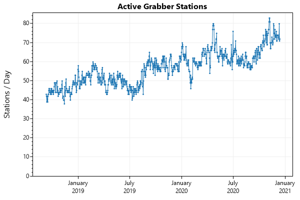
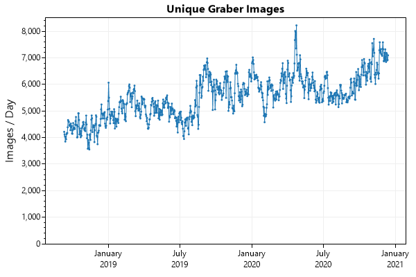
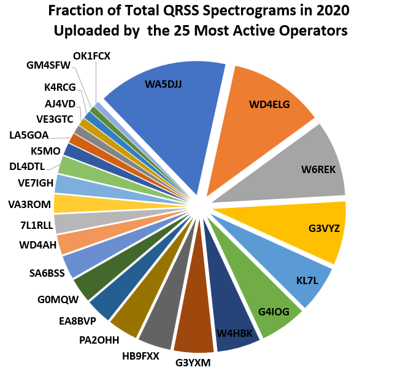

# Seven Years of QRSS Plus

> This article was written for [Andy (G0FTD)](https://sites.google.com/view/andy-g0ftd/) for publication in the December 2020 edition of [74!, The Knights QRSS Newsletter](https://swharden.com/qrss/74/). Join the [QRSS Knights mailing list](https://groups.io/g/qrssknights) for the latest QRSS news.

The QRSS hobby owes much of its success to the extraordinary efforts of amateur radio operators who run and maintain QRSS grabber stations. QRSS grabbers are built by pairing a radio receiver with a computer running software to continuously convert the received signals into spectrogram images which are uploaded to the internet every few minutes. [**QRSS Plus**](https://swharden.com/qrss/plus/) is a website that displays these spectrograms from active QRSS grabbers around the world. This article discusses the history of QRSS Plus, the technical details that make it possible, and highlights its most active contributors in 2020.

### Early Days of QRSS Grabber Websites

In the early 2010s when I started to become active in the QRSS community, one of my favorite grabber websites was [I2NDT's QRSS Knights Grabber Compendium](https://digilander.libero.it/i2ndt/grabber/grabber-compendium.htm). I remember checking that website from my laptop during class several times throughout the day to see if my signal was making it out of Gainesville, Florida. I also recall many nights at the bench tweaking my transmitter and looking at all the grabs from around the world trying to spot my signal. 

A common problem with QRSS grabber websites was the persistance of outdated grabber images. Whenever a grabber uploaded a new spectrogram image it replaced the previous one, but when a grabber stopped uploading new images the old one would remain. Most uploaded spectrograms have a date written in small text in the corner, but at a glance (and especially in thumbnails) it was difficult to identify which grabber images were current and which were outdated. 

### History of QRSS Plus

I created [QRSS Plus](https://swharden.com/qrss/plus/) in July 2013 to solve the problem of outdated spectrograms appearing on grabber websites. QRSS Plus works by downloading grabber images every 10 minutes and recording their [MD5 hash](https://en.wikipedia.org/wiki/MD5) (a way to convert an image into a unique set of letters such that when the image changes the letters change). Grabbers were marked "active" if the MD5 hash from their newest image was different than the one from the previous image. This original system was entirely operated as a PHP script which ran on the back-end of a web server triggered by a cron job to download new images and update a database every 10 minutes. The primary weakness of this method was that downloading all those images took a lot of time (they were downloaded sequentially on the server). PHP is famously single-threaded, and my web host limited how long PHP scripts could run, limiting the maximum number of supported grabbers.

The back-end of QRSS Plus was redesigned in 2016 when I changed hosting companies. The new company allowed me to execute python scripts on the server, so I was no longer limited by the constraints of PHP. I redesigned QRSS Plus to download, hash, and store images every 10 minutes. This allowed QRSS Plus to display a running history of the last several grabs for each grabber, as well as support automated image stacking (averaging the last several images together to improve visualization of weak, repetitive signals). This solution is still limited by CPU time (the number of CPU seconds per day is capped by my hosting company), but continuously operating QRSS Plus does not occupy a large portion of that time.

### QRSS Plus Activity in 2020

I started logging grabber updates in September 2018, allowing me to reflect on the last few years of grabber activity. It takes a lot of effort to set-up and maintain a quality QRSS grabber, and the enthusiasm and dedication of the QRSS community is impressive and inspiring! 

In 2020 our community saw ***155 active grabber stations***! On average there were more than 60 active stations running on any given day, and the number of active stations is visibly increasing with time.

In 2020 QRSS Plus analyzed a mean of 6,041 spectrograms per day. In total, QRSS Plus analyzed over ***2.2 million spectrograms*** this year!

This bar graph depicts the top 50 most active grabber stations ranked according to their total unique spectrogram upload count. Using this metric grabbers that update once every 10 minutes will appear to have twice as many unique grabber images as those which upload a unique image every 20 minutes.

Many QRSS grabber operators maintain multiple stations, and I think those operators deserve special attention! This year's winner for the most active contributor goes to David Hassall (WA5DJJ) who alone is responsible for 15.26% of the total number of uploaded spectrograms in 2020 🏆

The top 25 contributors with the greatest number of unique uploads in 2020 were (in order): WA5DJJ, WD4ELG, W6REK, G3VYZ, KL7L, G4IOG, W4HBK, G3YXM, HB9FXX, PA2OHH, EA8BVP, G0MQW, SA6BSS, WD4AH, 7L1RLL, VA3ROM, VE7IGH, DL4DTL, K5MO, LA5GOA, VE3GTC, AJ4VD, K4RCG, GM4SFW, and OK1FCX. 

### Maintaining QRSS Plus

I want to recognize Andy (G0FTD) for doing an extraordinary job maintaining the QRSS Plus website over the last several years! Although I (AJ4VD) created and maintain the QRSS Plus back-end, once it is set-up it largely operates itself. The QRSS grabber list, on the other hand, requires frequent curation. Andy has done a fantastic job monitoring the [QRSS Knights mailing list](https://groups.io/g/qrssknights) and updating the grabber list in response to updates posted there so it always contains the newest grabbers and uses the latest URLs. On behalf of everyone who enjoys using QRSS Plus, thank you for your work Andy!

### The Future of QRSS Plus

Today QRSS Plus is functional, but I think its front-end could be greatly improved. It is written using vanilla JavaScript, but I think moving to a front-end framework like React makes a lot of sense. Currently PHP generates HTML containing grabber data when the page is requested, but a public JSON API would make a lot of sense and make QRSS Plus it easier to develop and test. From a UX standpoint, the front-end could benefit from a simpler design that displays well on mobile and desktop browsers. I think the usability of historical grabs could be greatly improved as well. From a back-end perspective, I'd much prefer to run the application using a service like Azure or AWS rather than lean on a traditional personal website hosting plan to manage the downloads and image processing. Automatic creation of 8-hour (stitched and compressed) grabber frames seems feasible as well. It is unlikely I will work toward these improvements soon, but if you are a front-end web developer interested in working on a public open-source project, send me an email and I'd be happy to discuss how we can improve QRSS Plus together!

QRSS is a growing hobby, and if the rise in grabbers over the last few years is an indication of what the next few years will look like, I'm excited to see where the hobby continues to go! I encourage you to consider running a grabber (and to encourage others to do the same), and to continue to thank all the grabber operators and maintainers out there who make this hobby possible.

### Notes and Resources
* Data includes Jan 1 2020 through Dec 11 2020
* Stations with <1000 unique uploads were excluded from most analyses
* Summary data (a table of unique images per day per station) is available: [qrss-plus-2020.xlsx](qrss-plus-2020.xlsx)
* Bar graphs, scatter plots, and line charts were created with [ScottPlot](https://swharden.com/scottplot)
* QRSS Plus is [open source on GitHub](https://github.com/swharden/qrssplus)
* A modern introduction to QRSS: [The New Age of QRSS](https://swharden.com/blog/2020-10-03-new-age-of-qrss)
* [FSKview](https://swharden.com/software/FSKview) is a new QRSS and WSPR Spectrogram Viewer for Windows