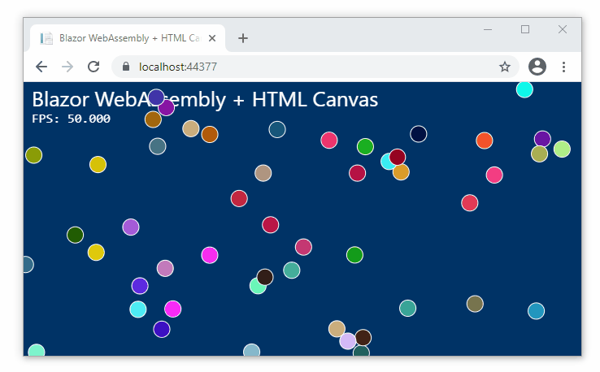

# Draw Animated Graphics in the Browser with Blazor WebAssembly

**Client-side Blazor allows C# graphics models to be rendered in the browser.** This means .NET developers can create web apps with business logic written (and tested) in C# instead of being forced to write their business logic in a totally different language (JavaScript) just to get it to run in the browser. In this project we'll create an interactive graphics model (a field of balls that bounce off the edge of the screen) entirely in C#, and draw the model on the screen using an API that allows us to interact with a HTML5 Canvas.

<div class="center">

[](app)

</div>

* [**View the live demo**](app)
* [**Download the source code**](blazor-canvas.zip)

## Strategy

**At the time of this writing Blazor WebAssembly can't directly paint on the screen, so JavaScript is required somewhere to make this happen.** The [`Blazor.Extensions.Canvas`](https://github.com/BlazorExtensions/Canvas) package has a Canvas component and provides a C# API for all of its JavaScript methods, allowing you to draw on the canvas entirely from C#. 

**Rendering gets a little slower every time a JavaScript function is called from Blazor.** If a large number of shapes are required (a lot of JavaScript calls), performance may be limited compared to a similar application written entirely in JavaScript. For high performance rendering of many objects, a rendering loop written entirely in JavaScript may be required.

**This method is good for simple models with a limited number of shapes.** It allows the business logic (and tests) to remain entirely in C#. The same graphics model code could be displayed in the browser (using HTML canvas) or on the desktop in WPF and WinForms apps (using System.Drawing or SkiaSharp).

## Step 1: Create a Pure C# Graphics Model

**I'm using _graphics model_ to describe the state of the field of balls and logic required to move each ball around.** Ideally this logic would be isolated in a separate library. At the time of writing a .NET Standard C# library seems like a good idea, so the same graphics model could be used in .NET Framework and .NET Core environments.

### Models/Ball.cs

```cs
public class Ball
{
    public double X { get; private set; }
    public double Y { get; private set; }
    public double XVel { get; private set; }
    public double YVel { get; private set; }
    public double Radius { get; private set; }
    public string Color { get; private set; }

    public Ball(double x, double y, double xVel, double yVel, double radius, string color)
    {
        (X, Y, XVel, YVel, R, Color) = (x, y, xVel, yVel, radius, color);
    }

    public void StepForward(double width, double height)
    {
        X += XVel;
        Y += YVel;
        if (X < 0 || X > width)
            XVel *= -1;
        if (Y < 0 || Y > height)
            YVel *= -1;

        if (X < 0)
            X += 0 - X;
        else if (X > width)
            X -= X - width;

        if (Y < 0)
            Y += 0 - Y;
        if (Y > height)
            Y -= Y - height;
    }
}
```

### Models/Field.cs

```cs
public class Field
{
    public readonly List<Ball> Balls = new List<Ball>();
    public double Width { get; private set; }
    public double Height { get; private set; }

    public void Resize(double width, double height) =>
        (Width, Height) = (width, height);

    public void StepForward()
    {
        foreach (Ball ball in Balls)
            ball.StepForward(Width, Height);
    }

    private double RandomVelocity(Random rand, double min, double max)
    {
        double v = min + (max - min) * rand.NextDouble();
        if (rand.NextDouble() > .5)
            v *= -1;
        return v;
    }


    private string RandomColor(Random rand) => 
	    string.Format("#{0:X6}", rand.Next(0xFFFFFF));
	
    public void AddRandomBalls(int count = 10)
    {
        double minSpeed = .5;
        double maxSpeed = 5;
        double radius = 10;
        Random rand = new Random();

        for (int i = 0; i < count; i++)
        {
            Balls.Add(
                new Ball(
                    x: Width * rand.NextDouble(),
                    y: Height * rand.NextDouble(),
                    xVel: RandomVelocity(rand, minSpeed, maxSpeed),
                    yVel: RandomVelocity(rand, minSpeed, maxSpeed),
                    radius: radius,
                    color: RandomColor(rand);
                )
            );
        }
    }
}
```

## Step 2: Get the Blazor.Extensions.Canvas Package

Use NuGet to install [Blazor.Extensions.Canvas](https://github.com/BlazorExtensions/Canvas)

```cs
Install-Package Blazor.Extensions.Canvas
```

## Step 3: Add a script to index.html

**This JavaScript sets-up the render loop** which automatically calls `RenderInBlazor` C# method on every frame. It also calls the `ResizeInBlazor` C# function whenever the canvas is resized so the graphics model's dimensions can be updated. You can place it just before the closing `</body>` tag.

**This code will automatically resize the canvas and graphics model to fit the window,** but for a fixed-size canvas you can omit the `addEventListener` and `resizeCanvasToFitWindow` calls.

```html
<script src='_content/Blazor.Extensions.Canvas/blazor.extensions.canvas.js'></script>
<script>
    function renderJS(timeStamp) {
        theInstance.invokeMethodAsync('RenderInBlazor', timeStamp);
        window.requestAnimationFrame(renderJS);
    }

    function resizeCanvasToFitWindow() {
        var holder = document.getElementById('canvasHolder');
        var canvas = holder.querySelector('canvas');
        if (canvas) {
            canvas.width = window.innerWidth;
            canvas.height = window.innerHeight;
            theInstance.invokeMethodAsync('ResizeInBlazor', canvas.width, canvas.height);
        }
    }

    window.initRenderJS = (instance) => {
        window.theInstance = instance;
        window.addEventListener("resize", resizeCanvasToFitWindow);
        resizeCanvasToFitWindow();
        window.requestAnimationFrame(renderJS);
    };
</script>
```

## Step 4: Create a page for the Canvas and Render code

This step ties everything together:
 * **The graphics model**: a private class stored at this level
 * **The canvas component**: a protected field
 * **The canvas**: a Razor component referencing the canvas component
 * **The init code**: which tells JavaScipt to start the render loop
 * **The render method**: C# function called from the JavaScript render loop when a frame is to be drawn
 * **The resize method**: C# function called from JavaScript to update the model when the canvas size changes
* **JavaScript runtime injection**: This allows Blazor/JavaScript interoperability (JS interop)

For simplicity it's demonstrated here using a code-behind, but a clearer strategy would be to move the render logic into its own class/file.

```cs
@page "/"

@using Blazor.Extensions
@using Blazor.Extensions.Canvas
@using Blazor.Extensions.Canvas.Canvas2D
@inject IJSRuntime JsRuntime;

<div id="canvasHolder" style="position: fixed; width: 100%; height: 100%">
    <BECanvas Width="600" Height="400" @ref="CanvasRef"></BECanvas>
</div>

@code{
    private Models.Field BallField = new Models.Field();
    private Canvas2DContext ctx;
    protected BECanvasComponent CanvasRef;
    private DateTime LastRender;

    protected override async Task OnAfterRenderAsync(bool firstRender)
    {
        this.ctx = await CanvasRef.CreateCanvas2DAsync();
        await JsRuntime.InvokeAsync<object>("initRenderJS", DotNetObjectReference.Create(this));
        await base.OnInitializedAsync();
    }

    [JSInvokable]
    public void ResizeInBlazor(double width, double height) => BallField.Resize(width, height);

    [JSInvokable]
    public async ValueTask RenderInBlazor(float timeStamp)
    {
        if (BallField.Balls.Count == 0)
            BallField.AddRandomBalls(50);
        BallField.StepForward();

        double fps = 1.0 / (DateTime.Now - LastRender).TotalSeconds;
        LastRender = DateTime.Now;

        await this.ctx.BeginBatchAsync();
        await this.ctx.ClearRectAsync(0, 0, BallField.Width, BallField.Height);
        await this.ctx.SetFillStyleAsync("#003366");
        await this.ctx.FillRectAsync(0, 0, BallField.Width, BallField.Height);
        await this.ctx.SetFontAsync("26px Segoe UI");
        await this.ctx.SetFillStyleAsync("#FFFFFF");
        await this.ctx.FillTextAsync("Blazor WebAssembly + HTML Canvas", 10, 30);
        await this.ctx.SetFontAsync("16px consolas");
        await this.ctx.FillTextAsync($"FPS: {fps:0.000}", 10, 50);
        await this.ctx.SetStrokeStyleAsync("#FFFFFF");
        foreach (var ball in BallField.Balls)
        {
            await this.ctx.BeginPathAsync();
            await this.ctx.ArcAsync(ball.X, ball.Y, ball.Radius, 0, 2 * Math.PI, false);
            await this.ctx.SetFillStyleAsync(ball.Color);
            await this.ctx.FillAsync();
            await this.ctx.StrokeAsync();
        }
        await this.ctx.EndBatchAsync();
    }
}
```

**Notice how the JavaScript calls are wrapped in `BeginBatchAsync` and `EndBatchAsync`.** This allows the calls between these two statements to be bundled into a single call. Since Blazor/JavaScript interop calls are the primary bottleneck in this system, limiting the number of individual JavaScript calls has a large influence on final performance.

## Notes and References

> **💡 I observed a strong performance increase when upgrading from .NET Core 3.1 to .NET 5.** If you can, [Migrate your Blazor project to .NET 5](https://docs.microsoft.com/en-us/aspnet/core/migration/31-to-50#update-blazor-webassembly-projects) or newer

* **A hybrid JavaScript/C# architecture is be possible** involving exchange of graphics model _data_, whereby JavaScript is used to render a model but C# is used to advanced the model. This could be achieved with a single interop call passing model data as JSON. This is explored in the later blog posts [Mystify your Browser with Blazor](https://swharden.com/blog/2021-01-09-blazor-mystify/) and [Boids in your Browser with Blazor](https://swharden.com/blog/2021-01-08-blazor-boids/).

* **Live demo of this project**: [Ball field demo](app)

* **Source code for this project**: [blazor-canvas.zip](app)

* **C# Data Visualization:** https://github.com/swharden/Csharp-Data-Visualization