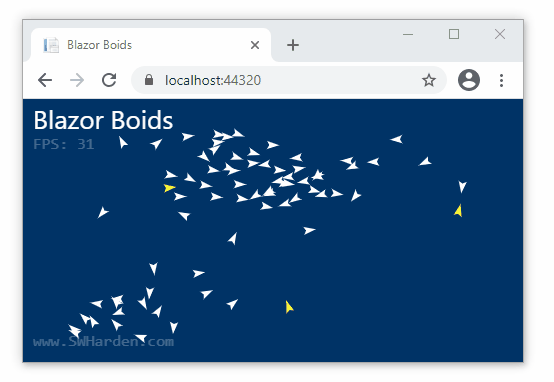
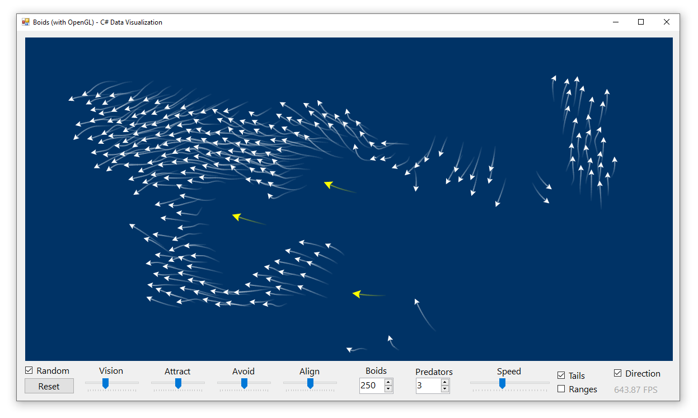

# Boids in your Browser with Blazor

**This project implements the [Boids flocking algorithm](https://en.wikipedia.org/wiki/Boids) in C# and uses Blazor WebAssembly to render it in the browser.** Drone birds (bird-oids, or boids) follow a simple set of rules to determine their angle and velocity. When many boids are placed in a field together, interesting group behaviors emerge. Details about the boid flocking algorithm are discussed in depth elsewhere. This article summarizes how to configure a Blazor application to _model_ graphics with C# and _render_ them with JavaScript.

<div class="center">

[](app)

</div>

### Live Demo

* Boids with default settings: [app/](app/)

* Boids with custom settings: [app/?boids=100&predators=5](app/?boids=100&predators=5)

* Pro tip: resize your window really small and watch what happens!

## The C# Boids Model

The code that manages the field of boids is entirely written in C#. It tracks the positions of boids and advances their positions and directions over time, but it does not manage rendering. Briefly, 

* A `BoidField` has a width, height, and array of Boids
* Each `Boid` has a position, direction, and velocity
* Each `Boid` can advance itself by considering the positions of all the other boids:
  * Rule 1: boids steer toward the center of mass of nearby boids
  * Rule 2: boids adjust direction to match nearby boids
  * Rule 3: boids adjust speed to match a match a target
  * Rule 4: boids steer away from very close boids
  * Rule 5: boids steer away from boids marked as predators
  * Rule 6: boids are repelled by the edge of the window

## Model with C#, Render with JavaScript

At the time of writing, the most performant way to render high frame rates in the browser is to write your model and business logic entirely in JavaScript. The purpose of this project is _not_ to make the most performant model possible, but rather to explore what can be done with client-side Blazor and WebAssembly. There is a strong advantage to being able to keep keeping your graphics model and business logic in C#, especially if it is already written and extensively tested.

In my _[Draw Animated Graphics in the Browser with Blazor WebAssembly](https://swharden.com/blog/2021-01-07-blazor-canvas-animated-graphics/)_ article we used `Blazor.Extensions.Canvas` to draw on a HTML Canvas from C# code. Although this worked, it was limited by the fact that interop calls can be slow. Even though they can be batched, they still represent a significant bottleneck when thousands of calls need to be made on every frame.

In this project I used C# to model the field of boids, converted the field to JSON (with each boid having a X/Y position and a rotation), and had JavaScript parse the boid array and render each boid using a rendering function inside JavaScript.

## Source Code

The full source code can be downloaded here ([blazor-boids.zip](blazor-boids.zip)) or navigated on GitHub [C# Data Visualization: Blazor Boids](https://github.com/swharden/Csharp-Data-Visualization/tree/master/examples/2021-01-08-blazor-boids/BlazorBoids). The C# code for `Boid` and `BoidField` can be found there. What I'll focus on here is the key Blazor code required to manage the model and render it using JavaScript.

### index.razor

There are a lot of different things going on here. Most of them can be figured out with a little visual inspection. Here are the highlights:

* A canvas is created inside a div, each with a unique ID so they can be referenced from JavaScript.

* A `IJSRuntime` is injected so JS functions can be called from C#. Specifically, the `initRenderJS` is called when the component is first rendered.

* A `NavigationManager` is injected to let us easily work with query strings (Note that `QueryHelpers` requires the `Microsoft.AspNetCore.WebUtilities` NuGet package).

* A `boidField` graphics model is created as a private field and initialized `OnAfterRender` using query strings to customize the initializer parameters.

* The `UpdateModel()` method is decorated with `JSInvokable` so it can be called from JavaScript. It accepts a width and height (which may change if the browser size changes) and can resize the `boidField` as needed. It advances the model then converts the positions and directions of all boids to JSON and returns it as a string.

```cs
@page "/"
@using System.Text;
@inject IJSRuntime JsRuntime
@inject NavigationManager NavManager
@using Microsoft.AspNetCore.WebUtilities

<div id="boidsHolder" style="position: fixed; width: 100%; height: 100%">
    <canvas id="boidsCanvas"></canvas>
</div>

@code{
    private Random rand = new Random();
    private Models.Field boidField;

    protected override async Task OnAfterRenderAsync(bool firstRender)
    {
        // call the initialization JavaScript function
        await JsRuntime.InvokeAsync<object>("initRenderJS", DotNetObjectReference.Create(this));
        await base.OnInitializedAsync();

        // use a query string to customize the number of boids
        int boidCount = 75;
        var uri = NavManager.ToAbsoluteUri(NavManager.Uri);
        if (QueryHelpers.ParseQuery(uri.Query).TryGetValue("boids", out var boidCountString))
            if (int.TryParse(boidCountString, out int parsedBoidCount))
                boidCount = parsedBoidCount;

        // use a query string to customize the number of predators
        int predatorCount = 3;
        if (QueryHelpers.ParseQuery(uri.Query).TryGetValue("predators", out var predatorCountString))
            if (int.TryParse(predatorCountString, out int parsedPredatorCount))
                predatorCount = parsedPredatorCount;

        // create the model using the custom settings
        boidField = new Models.Field(800, 600, boidCount, predatorCount);
    }

    [JSInvokable]
    public string UpdateModel(double width, double height)
    {
        if (boidField is null)
            return "";

        boidField.Resize(width, height);
        boidField.Advance(bounceOffWalls: true, wrapAroundEdges: false);

        StringBuilder sb = new StringBuilder("[");
        foreach (var boid in boidField.Boids)
        {
            double x = boid.X;
            double y = boid.Y;
            double r = boid.GetAngle() / 360;
            sb.Append($"[{x:0.0},{y:0.0},{r:0.000}],");
        }

        sb.Append(boidField.PredatorCount.ToString());
        sb.Append("]");
        return sb.ToString();
    }
}
```

### index.html

Two JavaScript functions are added to the HTML:

* `renderJS()` - this function calls C# to update the model and request the latest data, then calls itself to create an infinite render loop. Each time it executes it:
  * resizes the canvas to fit the div it's inside of
  * calls the C# `UpdateModel()` method (passing in the latest canvas size)
  * parses the JSON the C# method returns to obtain an array of boid details
  * clears the canvas by filling it with a blue color
  * renders each boid (by translating and rotating the canvas, not the boid)
  * requests itself be rendered again so rendering continues infinitely
* `initRenderJS` - this function is called from Blazor so the running instance can be referenced in the future. It also starts the infinite render loop.

```html
<script>

    function renderJS() {

        // resize the canvas to fit its parent (resizing clears the canvas too)
        var holder = document.getElementById('boidsHolder');
        var canvas = document.getElementById('boidsCanvas');
        canvas.width = holder.clientWidth;
        canvas.height = holder.clientHeight;

        // tell C# about the latest dimensions, advance the model, and parse the new data
        var boidsString = window.theInstance.invokeMethod('UpdateModel', canvas.width, canvas.height);
        var boids = JSON.parse(boidsString);
        var predatorCount = boids.pop();

        // render each boid
		var ctx = document.getElementById('boidsCanvas').getContext('2d');
        for (var i = 0; i < boids.length; i++) {
            var predator = i < predatorCount;
            var boid = boids[i];
            var x = boid[0];
            var y = boid[1];
            var rotation = boid[2];
            ctx.save();
            ctx.translate(x, y);
            ctx.rotate(rotation * 2 * Math.PI);
            ctx.beginPath();
            ctx.moveTo(0, 0);
            ctx.lineTo(4, -2);
            ctx.lineTo(0, 10);
            ctx.lineTo(-4, -2);
            ctx.lineTo(0, 0);
            ctx.closePath();
            ctx.fillStyle = predator ? '#FFFF00' : '#FFFFFF';
            ctx.fill();
            ctx.restore();
        }

        // call this same function to render the next frame
        window.requestAnimationFrame(renderJS);
    }

    window.initRenderJS = (instance) => {
        window.theInstance = instance;
        window.requestAnimationFrame(renderJS);
    };

</script>
```

## Resources

### Blazor Boids

* Launch _Blazor Boids_ with default settings: [app/](app/)

* Launch _Blazor Boids_ with custom settings: [app/?boids=100&predators=5](app/?boids=100&predators=5)

### Blazor Source Code

* Download source: [blazor-boids.zip](blazor-boids.zip)

* View source on GitHub: [C# Data Visualization: Blazor Boids](https://github.com/swharden/Csharp-Data-Visualization/tree/master/examples/2021-01-08-blazor-boids/BlazorBoids)

* [Draw Animated Graphics in the Browser with Blazor WebAssembly](https://swharden.com/blog/2021-01-07-blazor-canvas-animated-graphics/) uses a render loop written in C# (instead of JavaScript) using `Blazor.Extensions.Canvas`. It's a bit slower as a result, but for simple models it has the advantage of not having to write a JavaScript rendering method.

### Boids in C# (Windows Application)

* [Boids in C#](https://swharden.com/CsharpDataVis/boids/boids.md.html) - a Windows application that runs much faster than this Blazor app. It has controls to customize flocking parameters. This was the source of the C# model I used for this Blazor app.

<div class="center">

[](https://swharden.com/CsharpDataVis/boids/boids.md.html)

</div>

### JavaScript Boids Simulators

**Obviously a native JavaScript Boids simulator will be much faster.** Implementing this Blazor app in JavaScript would have meant translating the model from C# to JavaScript. For performance-critical rendering-intensive applications, this is the way to go at the time of writing.

* [Boids algorithm demonstration](https://eater.net/boids) by Ben Eater (featured in SmarterEveryDay's [YouTube Video](https://youtu.be/4LWmRuB-uNU?t=187) about flocking birds)
* [Boids: Flocking made simple](http://www.harmendeweerd.nl/boids/) by Harmen de Weerd
* [Flocking](https://processing.org/examples/flocking.html) by Daniel Shiffman
* [Flocking Simulation](http://www.emergentmind.com/boids) by Matt Mazur
* [Simulate How Birds Flock in Processing](https://medium.com/swlh/boids-a-simple-way-to-simulate-how-birds-flock-in-processing-69057930c229) by Takuma Kakehi

### Literature
* [Boids: Background and Update](https://www.red3d.com/cwr/boids/) by Craig Reynolds (the inventor of boids)
* [Boids on Wikipedia](https://en.wikipedia.org/wiki/Boids)
* [3 Simple Rules of Flocking Behaviors: Alignment, Cohesion, and Separation](https://gamedevelopment.tutsplus.com/tutorials/3-simple-rules-of-flocking-behaviors-alignment-cohesion-and-separation--gamedev-3444)
* [Boids Code Golf](https://codegolf.stackexchange.com/questions/154277/implement-the-boids-algorithm)
