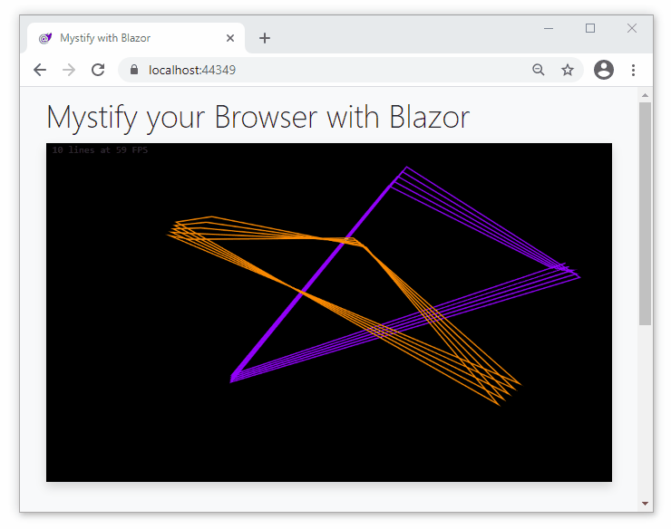

# Mystify your Browser with Blazor

**The project simulates the classic _Mystify your Mind_ screensaver from Windows 3 using client-side Blazor.** The graphics model logic is entirely C# and the web interface has user-facing options (razor components) to customize its behavior in real time. To render a frame JavaScript calls a C# function that returns JSON containing an array of line details (colors and coordinates) so a JavaScript render function can draw them on a HTML canvas. While [.NET APIs for drawing on canvases](https://swharden.com/blog/2021-01-07-blazor-canvas-animated-graphics/) exist, I find this method to be a bit more versatile because it does not require any external libraries, and it only makes a single JS interop call on each render so it is appreciably faster.

<div class="center">

[](app)

</div>

### Live Demo

* [Mystify your Browser with Blazor](app/) 👈 ***Launch the demo***

## The C# Graphics Model

The point of this article is to discuss strategies for rendering graphics using client-side Blazor and WebAssembly, so I won't detail how the polygons are tracked here. Source code for these classes can be viewed on GitHub ([MystifyBlazor/Models](https://github.com/swharden/Csharp-Data-Visualization/tree/master/examples/2021-01-09-blazor-mystify/MystifyBlazor/Models)) or downloaded with this project ([blazor-mystify.zip](blazor-mystify.zip)).

* [`Models/Color.cs`](https://github.com/swharden/Csharp-Data-Visualization/blob/master/examples/2021-01-09-blazor-mystify/MystifyBlazor/Models/Color.cs) - Represents a color and has methods to help with hue-shifting

* [`Models/Corner.cs`](https://github.com/swharden/Csharp-Data-Visualization/blob/master/examples/2021-01-09-blazor-mystify/MystifyBlazor/Models/Corner.cs) - Represents a corner of a polygon (position, direction, and velocity) and has logic to move forward in time and bounce off walls

* [`Models/Polygon.cs`](https://github.com/swharden/Csharp-Data-Visualization/blob/master/examples/2021-01-09-blazor-mystify/MystifyBlazor/Models/Polygon.cs) - A polygon is just a color and a list of corners that are connected by a single line.

* [`Models/Shape.cs`](https://github.com/swharden/Csharp-Data-Visualization/blob/master/examples/2021-01-09-blazor-mystify/MystifyBlazor/Models/Shape.cs) - A Shape is a moving polygon, and this class contains a list of polygons (a historical record of a single polygon's configuration as it changed over time).

* [`Models/Field.cs`](https://github.com/swharden/Csharp-Data-Visualization/blob/master/examples/2021-01-09-blazor-mystify/MystifyBlazor/Models/Field.cs) - Represents the rectangular render area and holds multiple shapes. 
  * This is the only class Blazor directly interacts with3
  * Configuration options (like rainbow mode) are public fields that can be bound to inputs on Razor pages
  * This class can return rendering instructions as JSON. This is just an array of lines, each with a color and an array of X/Y points.

## index.razor

### Canvas and Holder

This is the HTML that holds the HTML canvas. By using CSS to make the canvas background black I don't have to concern myself with manually drawing a black background on every new frame.

Note that I'm using [Bootstrap 5](https://getbootstrap.com/) (not the Bootstrap 4 that currently comes with new Blazor projects), so the classes may be slightly different.

```html
@page "/"

<div class="bg-white shadow mt-3" id="myCanvasHolder">
    <canvas id="myCanvas" style="background-color: black;"></canvas>
</div>
```

### Code-Behind

The only goals here are to start the JavaScript render loop and provide a method JavaScript can call to get line data in JSON format. Notice the method called by JavaScript accepts `width` and `height` arguments so the data model can properly adjust to canvases that change size as the browser window changes dimensions.

```cs
@inject IJSRuntime JsRuntime

@code
{
    Models.Field MystifyField = new Models.Field();

    protected override void OnInitialized()
    {
        JsRuntime.InvokeAsync<object>("initRenderJS", DotNetObjectReference.Create(this));
    }

    [JSInvokable]
    public string UpdateModel(double width, double height)
    {
        MystifyField.Advance(width, height);
        return MystifyField.GetJSON();
    }
}
```

### Data Binding

User-facing configuration is achieved by binding public fields of the graphics model directly to input elements.

```html
<input type="range" 
    @bind="MystifyField.Speed" 
    @bind:event="oninput">

<input type="range" min="1"max="20"
    @bind="MystifyField.ShapeCount" 
    @bind:event="oninput">
    
<input type="range" min="3" max="20"
    @bind="MystifyField.CornerCount" 
    @bind:event="oninput" >
    
<input type="range" min="1" max="50"
    @bind="MystifyField.HistoryCount"
    @bind:event="oninput">

<button @onclick="MystifyField.RandomizeColors">
    Random Colors
</button>

<input type="checkbox" @bind="MystifyField.Rainbow">
```

## index.html

This file contains JavaScript to start the renderer (an infinite loop) and request line data as JSON from a C# function in each render.

Notice that the aspect ratio of the canvas is maintained by setting its with to be a fraction of its height. The canvas width and height are passed as arguments to the C# function which updates the model.

```html
<script>

    function renderJS() {

        // resize the canvas to fit its parent (resizing clears the canvas too)
        var holder = document.getElementById('myCanvasHolder');
        var canvas = document.getElementById('myCanvas');
        canvas.width = holder.clientWidth;
        canvas.height = canvas.width * .6;

        // tell C# about the latest dimensions, advance the model, and parse the new data
        var dataString = window.theInstance.invokeMethod('UpdateModel', canvas.width, canvas.height);
        var polys = JSON.parse(dataString);

        // render each polygon
        var lineCount = 0;
        var ctx = document.getElementById('myCanvas').getContext('2d');
        ctx.lineWidth = 2;
        for (var i = 0; i < polys.length; i++) {
            var poly = polys[i];
            var color = poly.shift();

            ctx.beginPath();
            for (var j = 0; j < poly.length; j++) {
                x = parseFloat(poly[j][0]);
                y = parseFloat(poly[j][1]);
                if (j == 0) {
                    ctx.moveTo(x, y);
                } else {
                    ctx.lineTo(x, y);
                }
            }
            ctx.strokeStyle = color;
            ctx.closePath();
            ctx.stroke();
            lineCount += 1;
        }

        window.requestAnimationFrame(renderJS);
    }

    window.initRenderJS = (instance) => {
        window.theInstance = instance;
        window.requestAnimationFrame(renderJS);
    };

</script>
```

## JSON

The JSON that C# passes to the JavaScript renderer is just an array of lines, each with a color and an array of X/Y points. This is an example JSON packet to render a single frame:

```
["#00FFB4",[665.26,767.31], [1098.58,250.94], [1159.48,206.49], [717.52,194.45]],
["#00FFB4",[660.94,757.61], [1089.18,257.06], [1166.11,203.76], [720.90,201.92]],
["#00FFB4",[656.62,747.92], [1079.78,263.18], [1172.73,201.03], [724.29,209.40]],
["#00FFB4",[652.30,738.22], [1070.38,269.31], [1179.36,198.30], [727.67,216.88]],
["#00FFB4",[647.98,728.53], [1060.98,275.43], [1185.99,195.57], [731.05,224.36]],
["#0049FF",[1219.26,656.86], [5.34,599.35], [454.87,716.81], [276.93,416.92]],
["#0049FF",[1224.78,648.28], [0.00,602.83], [455.97,708.21], [286.48,408.14]],
["#0049FF",[1230.30,639.69], [6.55,606.32], [457.08,699.61], [296.03,399.35]],
["#0049FF",[1235.81,631.11], [13.10,609.80], [458.19,691.02], [305.58,390.57]],
["#0049FF",[1241.33,622.53], [19.65,613.28], [459.29,682.42], [315.13,381.79]]
```

## Alternatively you can Render from C# 

There are wrappers to let you draw on a HTML canvas from .NET, allowing you to write your render function in C# instead of JavaScript. It is a bit of added complexity (requires a package) and is a bit slower (additional JavaScript interop calls), so I did not choose to use it for this project. 

See my earlier article [_Draw Animated Graphics in the Browser with Blazor WebAssembly_](https://swharden.com/blog/2021-01-07-blazor-canvas-animated-graphics) for an example of how to draw on a canvas from C# using the [`Blazor.Extensions.Canvas`](https://github.com/BlazorExtensions/Canvas) package.

## Performance Notes

Vanilla JavaScript will probably always be faster at rendering graphics in the browser than Blazor. If your application requires fast graphics, you'll have to write all your graphics model logic and render system in JavaScript. The great advantage of Blazor is that existing C# code that has already been developed (and extensively tested) can be used in the browser. At the time of writing, Speed is not Blazor's strong suit.

* This system starts to choke when the model represents more than a few lines. The bottleneck seems to be encoding all the data as JSON on the C# side.

* I tried using StringBuilder everywhere and also using `int` instead of `float`, but it did not produce large improvements.

* I also tired using the [`Blazor.Extensions.Canvas`](https://github.com/BlazorExtensions/Canvas) package so I could make all the rendering calls from C# (eliminating the conversion to JSON step). Because this required so many individual interop calls (even with batching), it was about twice as slow as the JS renderer implemented in the code above.

## Resources

* Download this project: [blazor-mystify.zip](blazor-mystify.zip)

* Launch the demo: [Mystify your Browser with Blazor](app/)

* Browse source on GitHub: [C# Data Visualization: MystifyBlazor](https://github.com/swharden/Csharp-Data-Visualization/tree/master/examples/2021-01-09-blazor-mystify/)