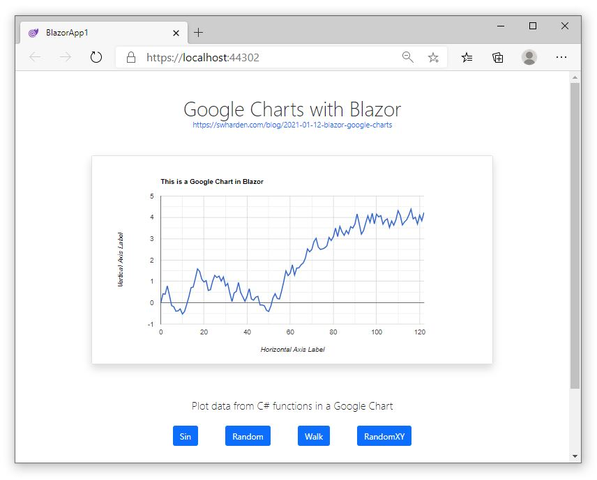

# Google Charts in Blazor

**Google Charts is a free interactive JavaScript charting framework.** The [Google Chart Gallery](https://developers.google.com/chart/interactive/docs/gallery) showcases many of the available chart types and options. This project shows how to create data from C# functions in Blazor, then use JavaScript interop to pass arrays into JavaScript for display with Google Charts.

<div class="text-center">

[](app)

</div>

* [Google Charts with Blazor Demo](app) 👈 Try it live!

* Source code: [blazor-google-charts.zip](blazor-google-charts.zip)

## index.razor

This page contains a `div` where the chart will be displayed, controls for customizing settings, and a few functions in the code-behind to call a JavaScript function that updates the chart.

```html
@page "/"
@inject IJSRuntime JsRuntime

<!-- this is where the Google Chart is displayed -->
<div id="chart_div" style="height: 400px;"></div>

<!-- buttons call C# functions -->
<button @onclick="PlotSin">Sin</button>
<button @onclick="PlotRandom">Random</button>
<button @onclick="PlotWalk">Walk</button>
<button @onclick="PlotRandomXY">RandomXY</button>

<!-- a slider bound to a C# field -->
<input type="range" @bind="PointCount" @bind:event="oninput">
```

```cs
@code{
    private int PointCount = 123;
    Random Rand = new Random();

    private void PlotData(double[] xs, double[] ys)
    {
        // This function calls a JavaScript function to update the chart.
		// Notice how multiple parameters are passed in.
        JsRuntime.InvokeVoidAsync("createNewChart", new { xs, ys });
    }

    private void PlotSin()
    {
        double[] xs = Enumerable.Range(0, PointCount).Select(x => (double)x).ToArray();
        double[] ys = xs.Select(x => Math.Sin(x / 10)).ToArray();
        PlotData(xs, ys);
    }

    private void PlotRandom()
    {
        double[] xs = Enumerable.Range(0, PointCount).Select(x => (double)x).ToArray();
        double[] ys = xs.Select(x => (Rand.NextDouble() - .5) * 1000).ToArray();
        PlotData(xs, ys);
    }

    private void PlotWalk()
    {
        double[] xs = Enumerable.Range(0, PointCount).Select(x => (double)x).ToArray();
        double[] ys = new double[PointCount];
        for (int i = 1; i < ys.Length; i++)
            ys[i] = ys[i - 1] + Rand.NextDouble() - .5;
        PlotData(xs, ys);
    }

    private void PlotRandomXY()
    {
        double[] xs = Enumerable.Range(0, PointCount).Select(x => Rand.NextDouble()).ToArray();
        double[] ys = Enumerable.Range(0, PointCount).Select(x => Rand.NextDouble()).ToArray();
        PlotData(xs, ys);
    }
}
```

## index.html

These JavaScript blocks were added just before the closing `</body>` tag

```js
<script type='text/javascript' src='https://www.gstatic.com/charts/loader.js'></script>

<script>
    google.charts.load('current', { packages: ['corechart', 'line'] });

    // draw an empty chart when the page first loads
    google.charts.setOnLoadCallback(initChart);
    function initChart() {
        var xs = [];
        var ys = [];
        window.createNewChart({xs, ys});
    }

    // draw a new chart given X/Y values
    window.createNewChart = (params) => {
        var xs = params.xs;
        var ys = params.ys;

        var data = new google.visualization.DataTable();
        data.addColumn('number', 'X');
        data.addColumn('number', 'Y');

        for (var i = 0; i < ys.length; i++) {
            data.addRow([xs[i], ys[i]]);
        }

        var options = {
            hAxis: { title: 'Horizontal Axis Label' },
            vAxis: { title: 'Vertical Axis Label' },
            title: 'This is a Google Chart in Blazor',
            legend: { position: 'none' },
        };

        var chart = new google.visualization.LineChart(document.getElementById('chart_div'));

        chart.draw(data, options);
    };

</script>
```

## Automatic Resizing

Plots look bad when the window is resized because Google Charts adopts a fixed size on each render. To give the appearance of fluid charts (that resize to fit their container as its size changes), add some JavaScript to re-render on every resize.

```js
window.onresize = function () { initChart(); };
```

We can't call our existing `createNewChart()` method because that expects data (from C#/Blazor) passed-in as a parameter. To support this type of resizing, the call from C# must be modified to _store_ data arrays at the window level so they can be later accessed when the chart is plotted again. This would take some re-structuring of this project, but it's possible.

## Conclusions

* Google Charts is a straightforward way to display data in mouse-interactive graphs on the web. 

* JS interop allows Blazor to pass data to a JavaScript function that can plot it on a Google Chart.

* Extra steps are required to automatically resize a Google Chart when its container size changes.

* For interactive graphs in desktop applications, check out [ScottPlot](https://swharden.com/scottplot) (an open-source plotting library for .NET that makes it easy to interactively display large datasets).

## Resources

* Live demo: [Google Charts with Blazor Demo](app)

* Source code: [blazor-google-charts.zip](blazor-google-charts.zip)

* Source code on GitHub: [/examples/2021-01-10-blazor-google-charts](https://github.com/swharden/Csharp-Data-Visualization/tree/master/examples/2021-01-10-blazor-google-charts)

* [C# Data Visualization](https://github.com/swharden/Csharp-Data-Visualization) on GitHub