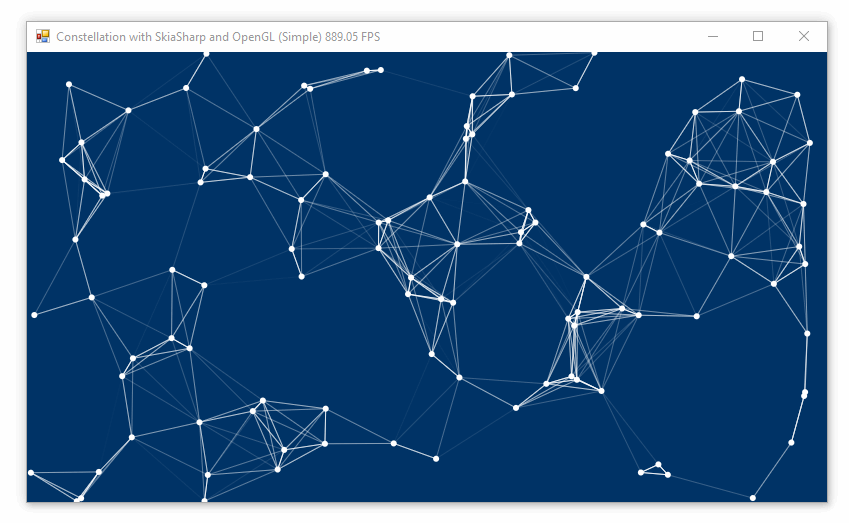
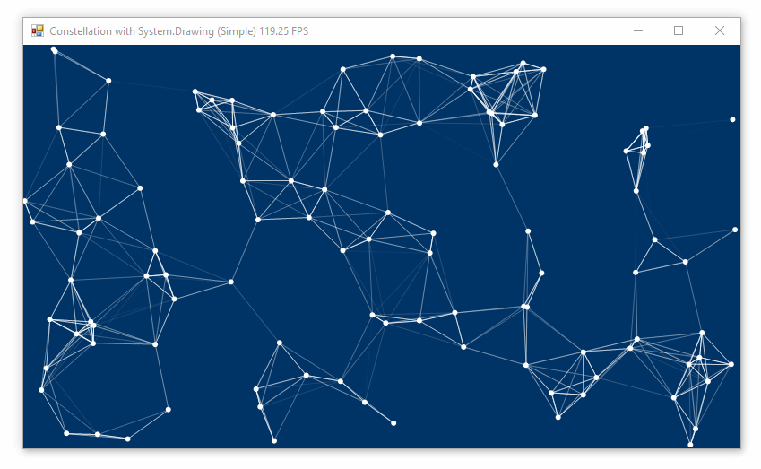

# Constellation Animation

In this series we will create a graphics model to simulate stars bouncing around the image area and connect close stars with lines to generate a constellation-like animation. We will place the model in its own library, then investigate how different software architectures can help decouple the rendering sequence (the logic behind drawing stars and lines) from the GUI platform (Windows Forms vs. WPF) and also the graphics library (System.Drawing vs. SkiaSharp).

<div class="text-center">



</div>

## Goals

**Design 1: GUI code will contain library-specific rendering methods.** While the graphics _model_ will be well-isolated in its own library, placing the rendering code inside the GUI couples it both to the GUI platform (WinForms or WPF) and the graphics library (System.Drawing or Skia).

**Design 2: Library-specific rendering will be isolated in a library.** This is a step in the right direction as it decouples our renderer from our GUI platform, but our rendering code is still coupled to the graphics library it uses evidenced by the fact we must write and maintain two nearly identical rendering libraries (one for System.Drawing, one for Skia).

**Design 3: Render inside the graphics model using an abstract renderer.** By creating an abstract renderer and injecting it into our model, all the domain-specific graphics tasks can be maintained in our graphics model library, and the _inversion of control_ (I in SOLID) achieved by this design allows the same render method to be used for different graphics libraries. In addition, all rendering occurs in a single method instead of two.

## Architecture 1: Implementation

Previous articles have demonstrated how to draw circles and lines, so this section will focus on the big picture organization of this project.

### Graphics Model & GUI are Separate Projects

* A .NET Standard class library has a `Field` class that keeps track of a bunch of `Star` objects (each with a position and velocity).
* A Windows Forms application was created for the System.Drawing implementation, and another for the SkiaSharp + OpenGL implementation.

### Threaded Graphics Model Updates Itself

Unlike previous projects which updated the graphics model on every render, this project uses threading _inside the graphics model_ to advance itself every 1ms. The advantage here is that the model continues to advance smoothly even if the rendering method is slow.

```cs

Thread advancerThread;
public Field(float width, float height, double density = 1)
{
    /* setup code removed */
    advancerThread = new Thread(new ThreadStart(AdvanceForever));
    advancerThread.Start();
}

bool keepAdvancing = true;
void AdvanceForever()
{
    while (keepAdvancing)
    {
        Advance();
        Thread.Sleep(1);
    }
}
```

When the class is instantiated, it will continuously advance itself every 1ms. There's a kill switch though: if `keepAdvancing` is set to `false` the continuous advancement will stop. By adding this kill switch we can cleanly shut-down the `advancerThread` when we want the program to close. Otherwise the program would continue to run in memory (advancing the model infinitely) even though the GUI closed.

```cs
public void Dispose()
{
    keepAdvancing = false;
}
```

While it's not shown here, the `Field` class inherits `IDisposable`. When it's disposed, the threaded renderer terminates. Be sure to intercept your GUI program's closing sequence to call `Field.Dispose()` so the graphics model shuts down and your program can fully close.

### Render with System.Drawing

Similar to previous examples we will display our image on a Picturebox. On every render a Bitmap is created sized to the Picturebox, a Graphics derived from that Bitmap, and after drawing the circles and lines the Bitmap is _copied_ to the Picturebox (properly disposing of the object that was previously assigned to it). The double-buffered nature of the Picturebox prevents flickering. This process is triggered by a Timer set to 1ms.

```cs
private void timer1_Tick(object sender, EventArgs e)
    using (Bitmap bmp = new Bitmap(pictureBox1.Width, pictureBox1.Height, PixelFormat.Format32bppPArgb))
    using (Graphics gfx = Graphics.FromImage(bmp))
    using (Brush brush = new SolidBrush(Color.White))
    using (Pen pen = new Pen(Color.White))
    {
        gfx.SmoothingMode = System.Drawing.Drawing2D.SmoothingMode.AntiAlias;

        // clear background
        gfx.Clear(ColorTranslator.FromHtml("#003366"));

        // draw stars
        float starRadius = 3;
        foreach (var star in field.Stars)
        {
            var rect = new RectangleF(
                    x: star.X - starRadius,
                    y: star.Y - starRadius,
                    width: starRadius * 2,
                    height: starRadius * 2
                );

            gfx.FillEllipse(brush, rect);
        }

        // draw lines connecting close stars
        double connectDistance = 100;
        foreach (var star1 in field.Stars)
        {
            foreach (var star2 in field.Stars)
            {
                double dX = Math.Abs(star1.X - star2.X);
                double dY = Math.Abs(star1.Y - star2.Y);
                if (dX > connectDistance || dY > connectDistance)
                    continue;
                double distance = Math.Sqrt(dX * dX + dY * dY);
                int alpha = (int)(255 - distance / connectDistance * 255);
                alpha = Math.Min(alpha, 255);
                alpha = Math.Max(alpha, 0);
                pen.Color = Color.FromArgb(alpha, Color.White);
                if (distance < connectDistance)
                    gfx.DrawLine(pen, star1.X, star1.Y, star2.X, star2.Y);
            }
        }

        pictureBox1.Image?.Dispose();
        pictureBox1.Image = (Bitmap)bmp.Clone();
    }
}
```

<div class="text-center">



</div>

### Render with SkiaSharp and OpenGL

The logic inside the render function is nearly identical to the System.Drawing version. This duplication of business logic is what we will seek to correct as we refactor this project in the future.

A `skglControl` is placed on the Form and its `Paint` event is captured so we can render on its `Surface.Canvas` property.

```cs
private void skglControl1_PaintSurface(object sender, SkiaSharp.Views.Desktop.SKPaintGLSurfaceEventArgs e)
{
    if (field is null)
        return;

    stopwatch.Restart();
    var canvas = e.Surface.Canvas;

    // clear background
    canvas.Clear(SKColor.Parse("#003366"));

    // draw stars
    float starRadius = 3;
    SKPaint paint = new SKPaint() { IsAntialias = true, Color = SKColors.White };
    foreach (var star in field.Stars)
    {
        var rect = new RectangleF(
                x: star.X - starRadius,
                y: star.Y - starRadius,
                width: starRadius * 2,
                height: starRadius * 2
            );

        var pt = new SKPoint(star.X, star.Y);
        e.Surface.Canvas.DrawCircle(pt, starRadius, paint);
    }

    // draw lines connecting close stars
    double connectDistance = 100;
    foreach (var star1 in field.Stars)
    {
        foreach (var star2 in field.Stars)
        {
            if (star1.Y >= star2.Y)
                continue; // prevent duplicate lines
            double dX = Math.Abs(star1.X - star2.X);
            double dY = Math.Abs(star1.Y - star2.Y);
            if (dX > connectDistance || dY > connectDistance)
                continue;
            double distance = Math.Sqrt(dX * dX + dY * dY);
            int alpha = (int)(255 - distance / connectDistance * 255) * 2;
            alpha = Math.Min(alpha, 255);
            alpha = Math.Max(alpha, 0);
            paint.Color = new SKColor(255, 255, 255, (byte)alpha);
            if (distance < connectDistance)
                canvas.DrawLine(star1.X, star1.Y, star2.X, star2.Y, paint);
        }
    }
}
```

A 1ms Timer is added periodically invalidate the `skglControl` and force continuous redrawing.

```cs
private void timer1_Tick(object sender, EventArgs e)
{
    skglControl1.Invalidate();
}
```

<div class="text-center">


</div>

## Source Code

GitHub: [/examples/drawing/constellation/simple](https://github.com/swharden/Csharp-Data-Visualization/tree/master/examples/drawing/constellation/simple)